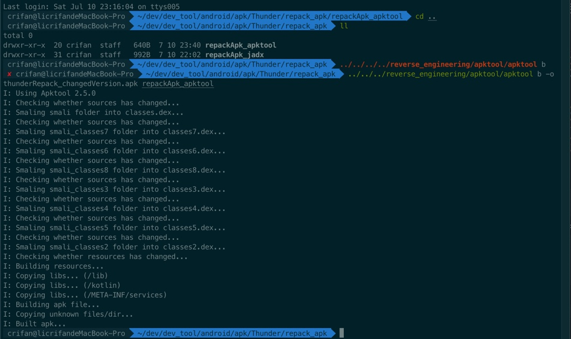

# 重新打包apk

TODO：

* 【记录】用apktool给脱壳后加了smali代码的各种文件重新打包为apk
* 【未解决】如何把破解和脱壳后的安卓apk重新打包出可用apk

---

```bash
apktool b inputFolder
apktool b inputFolder -o outputFilename.apk
```
* 参数说明
  * `b`=`build`=`编译`
    * =`重新打包`
  * `o`=`output`=输出文件名
    * 默认是：`dist/name.apk`

## 举例

### 重新打包迅雷的apk

```bash
apktool b -o thunderRepack_unsigned_unAlign.apk repackApk_jadx
```

或：

```bash
../../../reverse_engineering/apktool/apktool b -o thunderRepack_changedVersion.apk repackApk_apktool
```

* 输出：新的apk文件

详细log：

```bash
crifan@licrifandeMacBook-Pro  ~/dev/dev_tool/android/apk/Thunder/repack_apk  ll
total 0
drwxr-xr-x  20 crifan  staff   640B  7 10 23:40 repackApk_apktool
drwxr-xr-x  31 crifan  staff   992B  7 10 22:02 repackApk_jadx
 ✘ crifan@licrifandeMacBook-Pro  ~/dev/dev_tool/android/apk/Thunder/repack_apk  ../../../reverse_engineering/apktool/apktool b -o thunderRepack_changedVersion.apk repackApk_apktool
I: Using Apktool 2.5.0
I: Checking whether sources has changed...
I: Smaling smali folder into classes.dex...
I: Checking whether sources has changed...
I: Smaling smali_classes7 folder into classes7.dex...
I: Checking whether sources has changed...
I: Smaling smali_classes6 folder into classes6.dex...
I: Checking whether sources has changed...
I: Smaling smali_classes8 folder into classes8.dex...
I: Checking whether sources has changed...
I: Smaling smali_classes3 folder into classes3.dex...
I: Checking whether sources has changed...
I: Smaling smali_classes4 folder into classes4.dex...
I: Checking whether sources has changed...
I: Smaling smali_classes5 folder into classes5.dex...
I: Checking whether sources has changed...
I: Smaling smali_classes2 folder into classes2.dex...
I: Checking whether resources has changed...
I: Building resources...
I: Copying libs... (/lib)
I: Copying libs... (/kotlin)
I: Copying libs... (/META-INF/services)
I: Building apk file...
I: Copying unknown files/dir...
I: Built apk...
```


