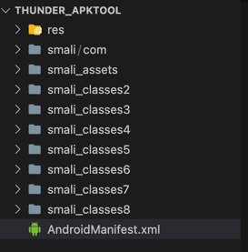
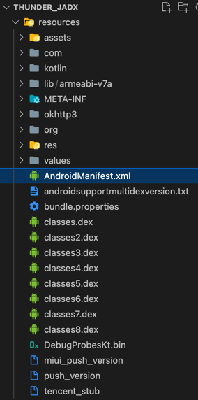
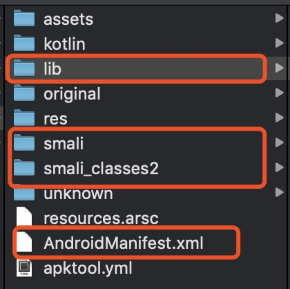
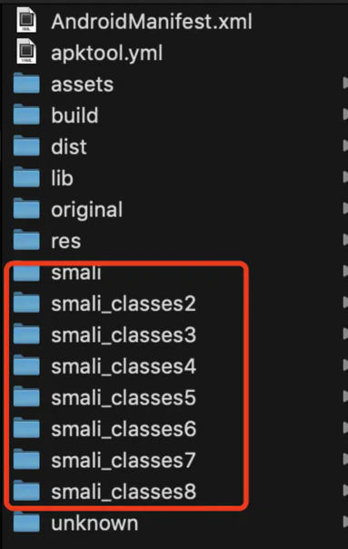
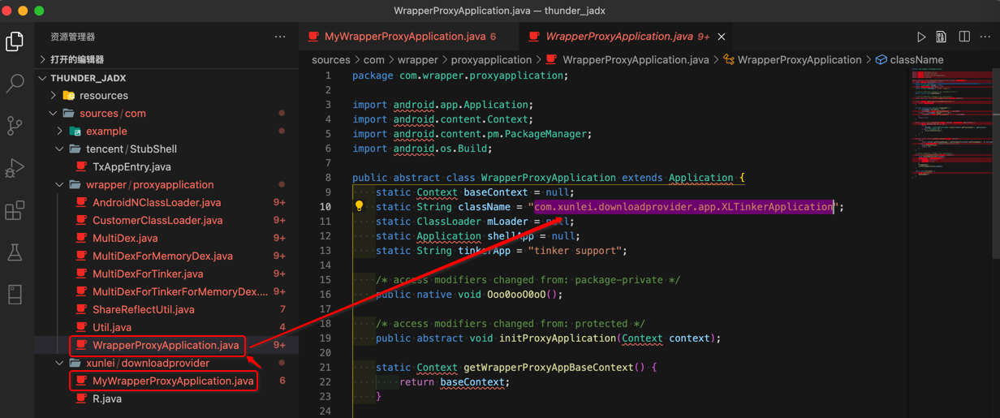
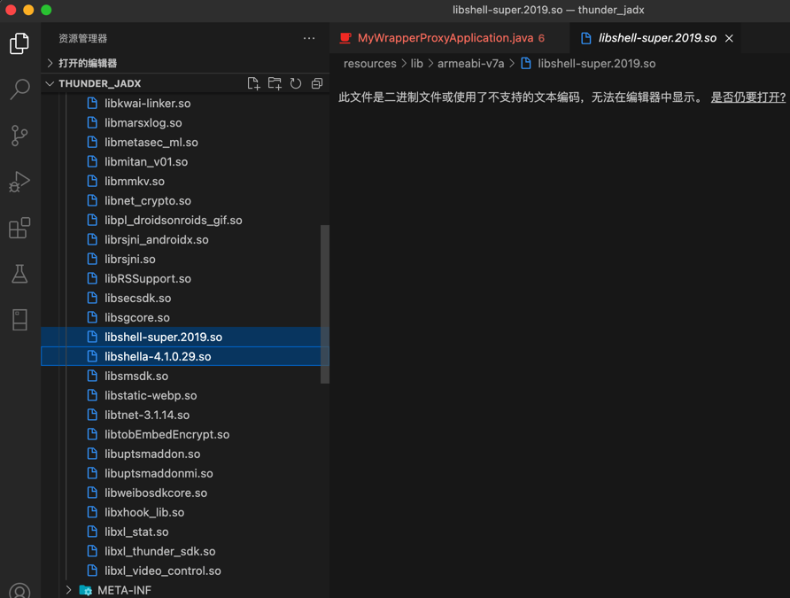

# 加固

对于加固的安卓apk，解包后，不能只是简单的修改源码了，还有额外的其他很多动作：

## 举例

### 腾讯乐固加固的迅雷apk

比如对于腾讯乐固加固的迅雷的apk，关于改动前后要考虑的事情有：

* 手上有可供重新打包的项目文件和目录
  * 对于重新打包的原始输入文件内容，来自：
    * apktool反编译后的所有内容
      * 
      * 注：此处`apktool`反编译出错而终止，所以内容不全
        * 成功反编译后，应该有`assets`、`lib`、`META-INF`、`res`等目录才对
    * `jadx`反编译后的`resources`目录下的所有内容
      * 
      * 注：此处`jadx`反编译，没有任何报错
        * 所以有完整的： `assets`、`lib`、`META-INF`、`res`、`kotlin`等相关目录
          * 但是其实dex方面的反编译，内部是有问题的，因为还是腾讯乐固加密，没有成功反编译
* `dex`转`smali`
  * 涉及到
    * `baksmali`
      * `mobsf`框架的`baksmali.jar`
    * 如果是加密的`dex`，则还要解密`dex`
      * 使用`DexExtractor`的`Decode.jar`进行解密
* 修改要打包的文件
  * 新增`smali`源码
    * 把`dex`转出的`smali`代码，放到对应文件夹中
      * `smali`
      * `smali_classes2`
      * `smali_classes3`
      * ...
    * 举例
      * 
      * 
  * 修复`AndroidManifest.xml`
    * 替换入口
      * `Application的android:name的com.tencent.StubShell.TxAppEntry`，换成实际的`app`的**入口**`Activity`
    * 此处是：`com.xunlei.downloadprovider.app.XLTinkerApplication`
      * 找到的入口：
        * `sources/com/wrapper/proxyapplication/WrapperProxyApplication.java`
          ```java
          public abstract class WrapperProxyApplication extends Application {
            static String className = "com.xunlei.downloadprovider.app.XLTinkerApplication";
          ```
            * 
  * 删除加固相关内容
    * 此处是腾讯乐固加密
      * 要删的（腾讯乐固加壳后新增的）相关内容是：
        * `jadx`反编译后
          * 
        * 能找到：
          * `resources/lib/armeabi-v7a/libshell-super.2019.so`
          * `resources/lib/armeabi-v7a/libshella-4.1.0.29.so`
          * 没找到：`libtpnsSecurity.so`
